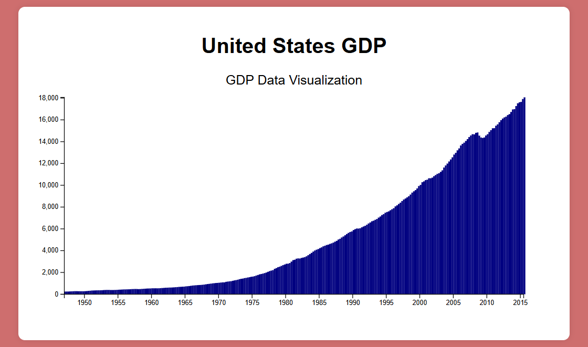

# ComputerScience_course

В данном репозитории хранятся работы, созданные во время прохождения курсов по общим направлениям Computer Science.

---

## 📊 1. [Data Visualization](DataVisualization/)

### 📝 Описание курса:
В ходе данного курса изучались методы визуализации данных с использованием библиотеки **D3.js**. Рассматривались принципы построения диаграмм, работа с API для загрузки данных со сторонних источников и создание интерактивных графиков.

### 📌 Изученные темы:
- Основы D3.js: селекции, привязка данных, генерация SVG-элементов
- Оси, шкалы и обработка данных
- Работа с API и асинхронный парсинг данных
- Создание интерактивных графиков и анимаций

### 🎯 Результаты:
- Гистограмма распределения данных
- Линейные и столбчатые графики
- Интерактивные элементы (hover, tooltips)

---

## 🖼 Пример работы:
  
*(Добавьте изображение с примерами визуализации, сохранив его в репозитории)*

---

## 🔗 Полезные ссылки:
- 📖 [Документация D3.js](https://d3js.org/)
- 🎓 [Курс по Data Visualization на freeCodeCamp](https://www.freecodecamp.org/learn/data-visualization/)
